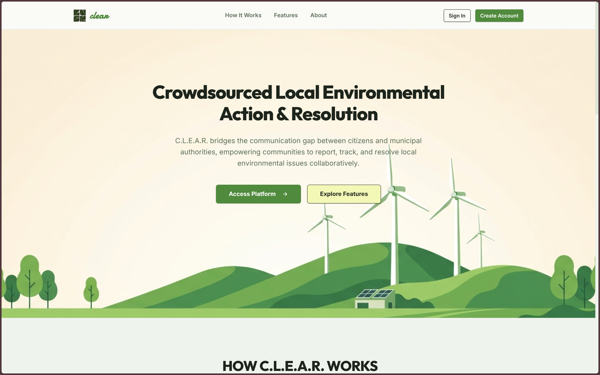
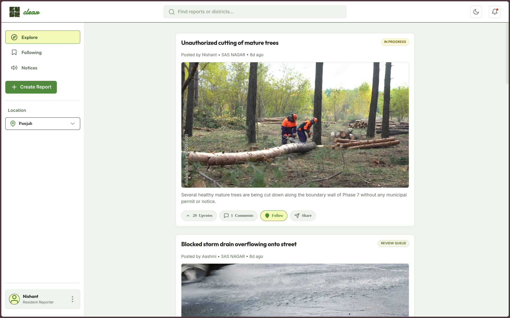
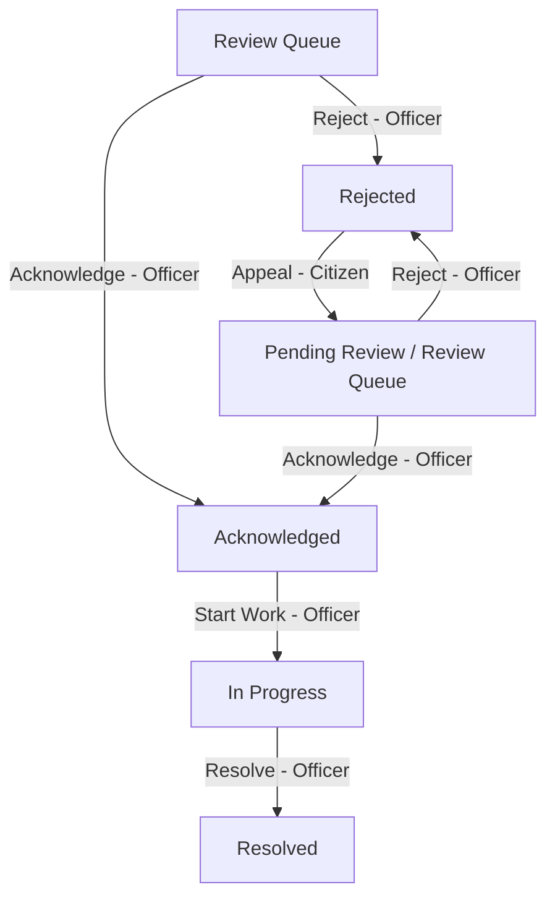

<p align="center">
  
</p>

<h1 align="center">🌿 C.L.E.A.R.</h1>

<p align="center">
  <b>Crowdsourced Local Environmental Action & Resolution</b><br/>
  <i>Empowering citizens and municipal officers to collaboratively track and resolve local environmental issues.</i>
</p>

<p align="center">
  <a href="#-user-interface-showcase">Showcase</a> •
  <a href="#-core-features--capabilities">Features</a> •
  <a href="#-system-workflows--design">System Design</a> •
  <a href="#-rest-api-reference">API Reference</a> •
  <a href="#-installation--setup">Setup Guide</a>
</p>

---

**C.L.E.A.R.** is a modern civic engagement platform designed to bridge the communication gap between local residents (citizens) and municipal operations officers. By facilitating the collaborative identification, tracking, and resolution of local environmental issues—such as illegal waste dumping, open garbage burning, drainage blockages, and hazardous spills—C.L.E.A.R. empowers communities to act as eyes on the ground, while providing municipal squads with structured triage and dispatch tools to resolve issues transparently.

---

## 📸 User Interface Showcase

Below is a visual guide to the C.L.E.A.R. application interfaces. (Screenshots can be found locally under `media/readme/`).

<table width="100%">
  <tr>
    <td width="50%" align="center"><b>Welcome & Landing Screen</b><br/></td>
    <td width="50%" align="center"><b>Citizen Dashboard (Public Feed)</b><br/></td>
  </tr>
  <tr>
    <td width="50%" align="center"><b>Create Environmental Report</b><br/></td>
    <td width="50%" align="center"><b>Municipal Triage Board (Kanban)</b><br/></td>
  </tr>
  <tr>
    <td width="50%" align="center"><b>Resolved Reports Feed & Archives</b><br/></td>
    <td width="50%" align="center"><b>Project-Specific Report Export (PDF)</b><br/></td>
  </tr>
  <tr>
    <td colspan="2" align="center"><b>Notices & Community Advisories</b><br/></td>
  </tr>
</table>

---

## 🛠️ Technology Stack & Architecture

C.L.E.A.R. is built with a lightweight, high-performance, single-page application (SPA) architecture combined with a robust Express + PostgreSQL relational backend:

*   **Frontend**: Single Page Application (SPA) utilizing semantic HTML5, Vanilla JavaScript (ES6+), and Vanilla CSS. Implements a customized **Subtle Neo-Brutalist** style system with responsive layouts, Outfit/Inter typography, and smooth micro-animations.
*   **Mapping & GIS**: [Leaflet.js](https://leafletjs.com/) with OpenStreetMap tiles for coordinate pin drops and interactive hazard mapping.
*   **Backend**: Node.js runtime environment running an [Express.js](https://expressjs.com/) server (`server.js`).
*   **Database & ORM**: PostgreSQL server integrated using [Prisma ORM](https://www.prisma.io/) with optimized indices, relation cascading, and transaction-safe queries.
*   **Security & Authentication**: Stateless session authentication via JSON Web Tokens (JWT) stored in secure, client-side HTTP-only cookies. Passwords are salted and hashed server-side using `bcryptjs`.
*   **File Storage**: Citizen and municipality photo attachments are converted and stored locally on the server disk under `/media/uploads/`.

---

## 🌟 Core Features & Capabilities

### 📢 Citizen Environmental Reporting
*   **Interactive Issue Submission**: Drop precise coordinate pins using integrated Leaflet/OpenStreetMap mapping, select a local district, choose hazard categories, and describe environmental issues.
*   **Visual Proof & Category Fallbacks**: Upload local cover photos or reference external links. Implements category-specific Unsplash fallbacks (e.g., dumping, water) if no custom photo is supplied.
*   **Anonymous Reporting Mode**: Toggle username visibility to file reports anonymously for community safety and privacy.
*   **Appeals Workflow**: Appeal rejected reports by submitting clarification notes and secondary verification photos to put the issue back in the municipal triage queue.

### 📎 Evidence & Multi-Contributor Attachments
*   **Collaborative Evidence Gathering**: Citizens can attach supporting evidence to existing reports filed by other residents, enabling community-driven investigation.
*   **Rich Attachments**: Submit supporting images (stored locally in `/media/uploads/` via base64 encoding) and relevant web links.
*   **Sleek UI Presentation**: Displays all multi-contributor attachments in a collapsible, Neo-Brutalist details panel to preserve interface space.
*   **Spam & Duplicate Control**: Enforces database-level constraints allowing only one unique attachment submission per user per report.

### ⚙️ Municipal Operations & Triage
*   **Administrative Auth Keys**: Registration and access are protected with a secure municipal Auth Key matching environment security.
*   **District-Scoped Triage**: Officers automatically filter and see only active reports belonging to their designated home district.
*   **3-Lane Kanban Workflow**: Manage operational flow through three distinct dispatch stages:
    1.  *Review Queue*: Initial unassessed citizen reports and active citizen appeals.
    2.  *Acknowledged*: Validated issues waiting for maintenance team scheduling.
    3.  *In Progress*: Dispatched teams working on resolution.
*   **Detailed Operations Drawer**: Slides out from the right to update status, append internal notes, record rejection reasons, and log resolution summaries with mandatory "after" photo verification.
*   **Community Bulletins**: Post time-bound official community warnings and environmental campaigns (e.g. stubble burning alerts) targeting specific districts.

### 👥 Role-Aware Workflows
*   **Role-Aware Filtering & Permissions**: Access to evidence items, Kanban lanes, and district listings dynamically adapts depending on user sub-roles.
*   **Investigator Role**: Accesses a read-only, restricted view of active/open reports in their home district, hiding resolved lists and administrative boards.
*   **Admin Role**: Full administrative oversight across all districts with a custom district selector.
*   **Authority Role**: Standard district-scoped operations and Kanban triage access.
*   **Interactive Simulator Switcher**: Officers can test different permissions instantly using a dynamic switcher built into their profile menu.

### 💬 Community Interaction & Engagement
*   **Priority Ranking Formula**: An algorithmic score weights upvotes and elapsed waiting hours to bubble urgent issues to the top:
    $$\text{Priority Score} = (\text{Upvotes} \times 1.5) + (\text{Hours Waiting} \times 0.15)$$
*   **Interactive Timelines & Comments**: Timeline event log records all stage updates. Citizens can discuss issues via commenting on report cards.
*   **In-App Alerts Feed**: A real-time notification system alerts citizens whenever the status of a followed report is updated.

### 📄 Project-Specific Report Export
*   **One-Click PDF Generation**: Export comprehensive, print-ready civic audit reports of resolved issues directly from the details panel.
*   **Professional Document Layout**: Employs the project's Outfit/Inter typographic styles and design borders for a polished presentation.
*   **Data Compilation**: Compiles citizen coordinates, initial description, full history logs, comments thread, internal squad notes, and before-and-after photo comparisons.
*   **Seamless Print Integration**: Automatically opens the system printing interface to save reports directly as PDFs.

---

## 📐 System Workflows & Design

### 1. Report Lifecycle & Status Transitions

The status transitions of a report are strictly tracked in the database and logged via a `TimelineEvent` relation for public auditing.



### 2. Priority Scoring Formula

Urgency ranking is calculated dynamically using a weighted formula taking into account upvotes and elapsed wait time since creation:

$$\text{Priority Score} = (\text{Upvotes} \times 1.5) + (\text{Hours Waiting} \times 0.15)$$

Issues are automatically categorized into three priority tiers:
*   🟢 **Low Priority**: Score $< 8$
*   🟡 **Medium Priority**: $8 \le \text{Score} < 20$
*   🔴 **High Priority**: Score $\ge 20$

---

## 📂 Project Directory Structure

```
clear/
├── docs/                   # Markdown guides & technical references
│   ├── API_REFERENCE.md    # Endpoint references, payloads, responses
│   ├── DATABASE_REFERENCE.md # DB schema analysis & indices
│   ├── PROJECT_OVERVIEW.md # Overall project summary & roles
│   ├── UI_GUIDELINES.md    # Design system, styling guidelines, tokens
│   ├── KNOWN_LIMITATIONS.md # Technical debt & placeholder elements
│   ├── CITIZEN_WORKFLOW.md # Citizen reporter workflows
│   ├── MUNICIPAL_WORKFLOW.md # Municipal triage & Kanban workflows
│   └── REPORT_LIFECYCLE.md # Stage transitions & status logic
├── media/                  # Media directories
│   ├── uploads/            # Server disk uploads ( citizen & officer photos )
│   ├── issues/             # Default mock image assets
│   └── readme/             # Visual gallery screenshots of the portal
├── prisma/                 # Database schema models & migrations
│   ├── schema.prisma       # Active Prisma schema configuration (PostgreSQL)
│   ├── seed.ts             # Seed script pre-populating mock users and issues
│   └── migrations/         # PostgreSQL database schema migration histories
├── public/                 # SPA Frontend static codebase
│   ├── favicon/            # Icons, manifests, and web assets
│   ├── app.js              # Application logic, components, API client, router
│   ├── brand-logo.js       # Reusable cursive logotype web component
│   ├── index.html          # Main HTML markup shell and modal layouts
│   └── style.css           # Neo-Brutalist CSS stylesheets and tokens
├── dev.js                  # Script running Express and Vite concurrently
├── server.js               # Express application server code
├── prisma.config.ts        # Prisma ORM pooled connection config
├── package.json            # Scripts and package dependency definitions
└── vercel.json             # Vercel hosting rules and configurations
```

---

## 🗄️ Database Schema & Models

Below is the structured layout of the relational entities modeled in [schema.prisma](file:///home/nish4nt/dev/clear/prisma/schema.prisma):

```
User (Citizen/Municipal Account)
 ├── reports (Created reports)
 ├── comments (Written comments)
 ├── follows (Followed issues)
 ├── upvotes (Upvoted issues)
 ├── notices (Created bulletins)
 └── notifications (Notifications feed)

Report (Environmental Issue)
 ├── author (User reference)
 ├── comments (Comment array)
 ├── timeline (TimelineEvent array)
 ├── followers (ReportFollow array)
 ├── voters (ReportUpvote array)
 ├── attachments (ReportAttachment array)
 └── notifications (Notification array)
```

### Detailed Relational Models

| Model | Key Fields | Purpose |
| :--- | :--- | :--- |
| **`User`** | `id` (UUID), `username`, `email`, `password` (Hashed), `role`, `district`, `authKey` | Represents citizens or municipal operations officers. |
| **`Report`** | `id` (Auto-increment), `title`, `description`, `location`, `subLocation` (District), `latitude`, `longitude`, `imageType`, `images`, `links`, `upvotes`, `status`, `internalNotes`, `resolutionNote`, `resolutionImages`, `isAnonymous` | Represents reported environmental issues and their current lifecycle states. |
| **`Comment`** | `id`, `reportId` (Cascade), `authorId`, `text`, `createdAt` | Community discussions posted in the report details panel. |
| **`TimelineEvent`** | `id`, `reportId` (Cascade), `status`, `timestamp` | Audit records for every status change, backing the public timeline. |
| **`ReportFollow`** | `userId`, `reportId` (Composite ID) | Links users to reports they wish to track. Triggers status notifications. |
| **`ReportUpvote`** | `userId`, `reportId` (Composite ID) | Multi-relation linking users to upvoted reports to enforce the 1-upvote limit. |
| **`Notice`** | `id`, `title`, `description`, `location`, `subLocation` (District), `type`, `expiryDate`, `authorId` | Bulletins and campaigns posted by municipal officers. |
| **`Notification`** | `id`, `userId`, `reportId`, `message`, `status`, `read` (Boolean) | Alert notifications generated on report status transitions. |
| **`ReportAttachment`** | `id`, `reportId`, `contributorId`, `attachmentImage`, `attachmentLink` (Composite Unique) | Secondary helper attachments (links/images) uploaded by contributors. |

---

## 📡 REST API Reference

All requests and responses use JSON formatting. Authenticated endpoints require a valid HTTP-only `token` cookie. Detailed definitions can be found in [API_REFERENCE.md](file:///home/nish4nt/dev/clear/docs/API_REFERENCE.md).

### 1. Authentication
*   `POST /api/auth/register` — Create a citizen or municipal officer account.
*   `POST /api/auth/login` — Sign in and obtain a secure JWT session cookie.
*   `GET /api/auth/me` (or `/api/user`) — Fetch current authenticated user payload.
*   `POST /api/auth/logout` (or `/api/user/logout`) — Destroy active JWT session cookie.

### 2. Citizens Operations
*   `GET /api/issues` — Query environmental reports with filtering (district, user-owned, followed, search query).
*   `POST /api/issues` — Submit a new environmental report.
*   `GET /api/issues/:id` — Get comprehensive details of a report, timeline, and comment thread.
*   `POST /api/issues/:id/comments` — Write a new comment on a report.
*   `POST /api/issues/:id/follow` — Toggle following status on a report.
*   `POST /api/issues/:id/vote` — Upvote an environmental report (max 1 upvote per user).
*   `POST /api/issues/:id/appeal` — Re-submit a rejected report with new explanation and image evidence.
*   `POST /api/issues/:id/attachment` — Add or update secondary image or link attachments.

### 3. Municipal Operations
*   `PATCH /api/issues/:id/status` — Triage status transitions (`Acknowledged`, `In Progress`, `Resolved`, `Rejected`).
*   `PATCH /api/issues/:id/notes` — Save operations notes (internal routing/squad dispatching schedules).
*   `POST /api/notices` — Create and publish a community warning bulletin.
*   `GET /api/notices` — Retrieve active community bulletins.

### 4. Notifications
*   `GET /api/notifications` — Retrieve the user's notification alerts feed.
*   `PATCH /api/notifications/:id/read` — Mark an individual notification alert as read.
*   `POST /api/notifications/clear` — Mark all user notification alerts as read.

---

## ⚙️ Installation & Setup

### Prerequisites
*   Node.js (version 18.0.0 or higher)
*   PostgreSQL Database instance

### 1. Configure Environments
Clone the environment template file:
```bash
cp .env.example .env
```
Open `.env` and fill in your connection string and security details:
```env
DATABASE_URL="postgresql://[user]:[password]@[host]:5432/[db_name]?sslmode=require"
JWT_SECRET="your-secure-random-jwt-secret"
MUNICIPAL_AUTH_KEY="your-secure-municipal-auth-key"
```

### 2. Setup the Relational Database
Install node dependencies:
```bash
npm install
```
Execute database migrations and generate the client schemas:
```bash
npx prisma migrate dev --name init
```
Seed the database with default users and active reports:
```bash
npx prisma db seed
```

### 3. Running the Development Server
Execute the development launcher to start both the Express backend and the Vite dev client concurrently:
```bash
npm run dev
```
Open your browser and navigate to:
*   **Frontend**: `http://localhost:5173`
*   **Backend API**: `http://localhost:3000`

---

## 🔑 Pre-Configured Testing Accounts

For rapid verification and triage simulation, use these pre-seeded accounts:

### 👤 Citizen Accounts (Resident Reporters)
*   **Nishant**: `user1@clear.com` (Password: `password` • ID: `user1`)
*   **Abhyudaya**: `user2@clear.com` (Password: `password` • ID: `user2`)
*   **Naman**: `user3@clear.com` (Password: `password` • ID: `user3`)
*   **Aashmi**: `user4@clear.com` (Password: `password` • ID: `user4`)

### 👮 Municipal Accounts (Operations Officers)
*   **SAS Nagar Municipal Officer**: `municipal1@clear.gov` (Password: `password` • Auth Key: `HX291Z` • District: `SAS NAGAR` • ID: `municipal1`)
*   **Ludhiana Municipal Officer**: `municipal2@clear.gov` (Password: `password` • Auth Key: `HX291Z` • District: `LUDHIANA` • ID: `municipal2`)
