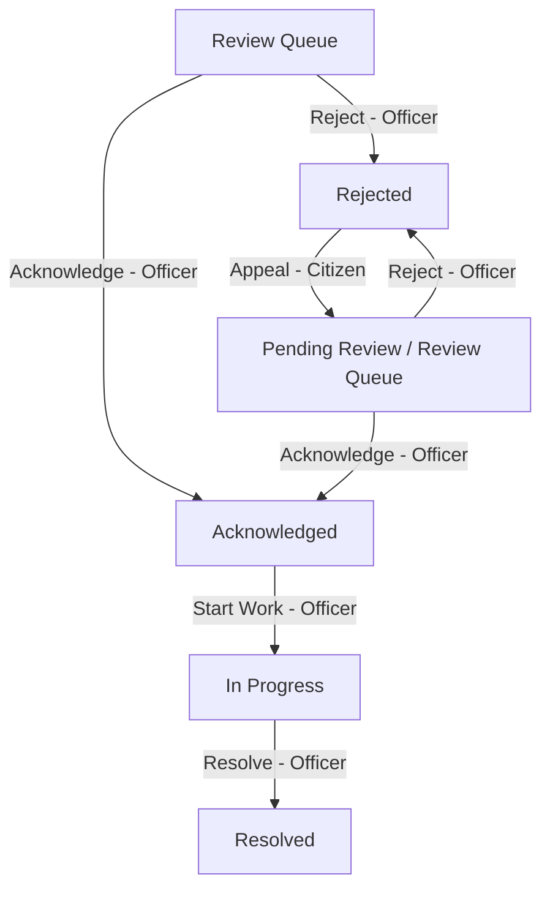

# 🌿 C.L.E.A.R. — Crowdsourced Local Environmental Action & Resolution

**C.L.E.A.R.** is a modern civic engagement platform designed to bridge the communication gap between local residents (citizens) and municipal operations officers. By facilitating the collaborative identification, tracking, and resolution of local environmental issues—such as illegal waste dumping, open garbage burning, drainage blockages, and hazardous spills—C.L.E.A.R. empowers communities to act as eyes on the ground, while providing municipal squads with structured triage and dispatch tools to resolve issues transparently.

---

## 📸 User Interface Showcase

Below is a visual guide to the C.L.E.A.R. application interfaces. (Screenshots can be found locally under `media/readme/`).

<table width="100%">
  <tr>
    <td width="50%" align="center"><b>Welcome & Landing Screen</b><br/></td>
    <td width="50%" align="center"><b>Role-Based Authentication</b><br/></td>
  </tr>
  <tr>
    <td width="50%" align="center"><b>Citizen Dashboard (District Filter)</b><br/></td>
    <td width="50%" align="center"><b>Citizen Feed (Issue Card & Actions)</b><br/></td>
  </tr>
  <tr>
    <td width="50%" align="center"><b>Municipal Operations Kanban Board</b><br/></td>
    <td width="50%" align="center"><b>Resolved Reports Feed (Municipal)</b><br/></td>
  </tr>
  <tr>
    <td width="50%" align="center"><b>Citizen Feed (Detailed Visual Cards)</b><br/></td>
    <td width="50%" align="center"><b>Exportable Civic Resolution Report</b><br/></td>
  </tr>
</table>

---

## 🛠️ Technology Stack & Architecture

C.L.E.A.R. is built with a lightweight, high-performance, single-page application (SPA) architecture combined with a robust Express + PostgreSQL relational backend:

*   **Frontend**: Single Page Application (SPA) utilizing semantic HTML5, Vanilla JavaScript (ES6+), and Vanilla CSS. Implements a customized **Subtle Neo-Brutalist** style system with responsive layouts, Outfit/Inter typography, and smooth micro-animations.
*   **Mapping & GIS**: [Leaflet.js](https://leafletjs.com/) with OpenStreetMap tiles for coordinate pin drops and interactive hazard mapping.
*   **Backend**: Node.js runtime environment running an [Express.js](https://expressjs.com/) server (`server.js`).
*   **Database & ORM**: PostgreSQL server integrated using [Prisma ORM](https://www.prisma.io/) with optimized indices, relation cascading, and transaction-safe queries.
*   **Security & Authentication**: Stateless session authentication via JSON Web Tokens (JWT) stored in secure, client-side HTTP-only cookies. Passwords are salted and hashed server-side using `bcryptjs`.
*   **File Storage**: Citizen and municipality photo attachments are converted and stored locally on the server disk under `/media/uploads/`.

---

## 👥 Roles & Capabilities

### 1. Resident Reporter (Civil / Citizen)
*   **Sign Up & Sign In**: Accesses the portal using standard email credentials.
*   **Report Environmental Issues**: Submits reports with a title, description, district, and coordinates (via Leaflet map marker).
*   **Visual Attachments**: Uploads physical photos and references external links. An automatic Unsplash image fallback maps categories (dumping, burning, water, warning) if no custom cover photo is supplied.
*   **Anonymous Mode**: Toggles public username visibility to submit reports anonymously.
*   **Community Interaction**: Upvotes issues to raise priority status (1 vote limit per user) and posts comments on report timelines.
*   **Appeal System**: Appeals rejected reports by submitting secondary evidence (text explanation + photo proof) to return the issue to the municipal queue.
*   **Real-time Alerts**: Accesses an in-app notification bell feed tracking status changes of followed reports.

### 2. Operations Officer (Municipal)
*   **Secure Registration**: Authenticates using a predefined secure administrative Auth Key.
*   **District-Level Triage**: Filters and displays issues strictly belonging to the officer's designated district.
*   **Kanban Board Control**: Manages issues across three distinct lanes:
    1.  *Review Queue*: Unassessed reports and citizen appeals.
    2.  *Acknowledged*: Accepted reports awaiting field squad dispatch.
    3.  *In Progress*: Active field team deployments.
*   **Actionable Triage Ribbon**: Slides open a details drawer to transition reports:
    *   `Acknowledge` or `Reject` reports (requiring strict categorization like private property, incorrect location, duplicate, etc.).
    *   `Start Work` to transition acknowledged tasks to active dispatches.
    *   `Resolve` reports (requiring a community note + "After" verification photo).
*   **Notice Board Bulletin**: Publishes and manages official community announcements (e.g. seasonal stubble burning alerts) with customizable expiration dates.

---

## 📐 System Workflows & Design

### 1. Report Lifecycle & Status Transitions

The status transitions of a report are strictly tracked in the database and logged via a `TimelineEvent` relation for public auditing.



### 2. Priority Scoring Formula

Urgency ranking is calculated dynamically using a weighted formula taking into account upvotes and elapsed wait time since creation:

$$\text{Priority Score} = (\text{Upvotes} \times 1.5) + (\text{Hours Waiting} \times 0.15)$$

Issues are automatically categorized into three priority tiers:
*   🟢 **Low Priority**: Score $< 8$
*   🟡 **Medium Priority**: $8 \le \text{Score} < 20$
*   🔴 **High Priority**: Score $\ge 20$

---

## 📂 Project Directory Structure

```
clear/
├── docs/                   # Markdown guides & technical references
│   ├── API_REFERENCE.md    # Endpoint references, payloads, responses
│   ├── DATABASE_REFERENCE.md # DB schema analysis & indices
│   ├── PROJECT_OVERVIEW.md # Overall project summary & roles
│   ├── UI_GUIDELINES.md    # Design system, styling guidelines, tokens
│   ├── KNOWN_LIMITATIONS.md # Technical debt & placeholder elements
│   ├── CITIZEN_WORKFLOW.md # Citizen reporter workflows
│   ├── MUNICIPAL_WORKFLOW.md # Municipal triage & Kanban workflows
│   └── REPORT_LIFECYCLE.md # Stage transitions & status logic
├── media/                  # Media directories
│   ├── uploads/            # Server disk uploads ( citizen & officer photos )
│   ├── issues/             # Default mock image assets
│   └── readme/             # Visual gallery screenshots of the portal
├── prisma/                 # Database schema models & migrations
│   ├── schema.prisma       # Active Prisma schema configuration (PostgreSQL)
│   ├── seed.ts             # Seed script pre-populating mock users and issues
│   └── migrations/         # PostgreSQL database schema migration histories
├── public/                 # SPA Frontend static codebase
│   ├── favicon/            # Icons, manifests, and web assets
│   ├── app.js              # Application logic, components, API client, router
│   ├── brand-logo.js       # Reusable cursive logotype web component
│   ├── index.html          # Main HTML markup shell and modal layouts
│   └── style.css           # Neo-Brutalist CSS stylesheets and tokens
├── dev.js                  # Script running Express and Vite concurrently
├── server.js               # Express application server code
├── prisma.config.ts        # Prisma ORM pooled connection config
├── package.json            # Scripts and package dependency definitions
└── vercel.json             # Vercel hosting rules and configurations
```

---

## 🗄️ Database Schema & Models

Below is the structured layout of the relational entities modeled in [schema.prisma](file:///home/nish4nt/dev/clear/prisma/schema.prisma):

```
User (Citizen/Municipal Account)
 ├── reports (Created reports)
 ├── comments (Written comments)
 ├── follows (Followed issues)
 ├── upvotes (Upvoted issues)
 ├── notices (Created bulletins)
 └── notifications (Notifications feed)

Report (Environmental Issue)
 ├── author (User reference)
 ├── comments (Comment array)
 ├── timeline (TimelineEvent array)
 ├── followers (ReportFollow array)
 ├── voters (ReportUpvote array)
 ├── attachments (ReportAttachment array)
 └── notifications (Notification array)
```

### Detailed Relational Models

| Model | Key Fields | Purpose |
| :--- | :--- | :--- |
| **`User`** | `id` (UUID), `username`, `email`, `password` (Hashed), `role`, `district`, `authKey` | Represents citizens or municipal operations officers. |
| **`Report`** | `id` (Auto-increment), `title`, `description`, `location`, `subLocation` (District), `latitude`, `longitude`, `imageType`, `images`, `links`, `upvotes`, `status`, `internalNotes`, `resolutionNote`, `resolutionImages`, `isAnonymous` | Represents reported environmental issues and their current lifecycle states. |
| **`Comment`** | `id`, `reportId` (Cascade), `authorId`, `text`, `createdAt` | Community discussions posted in the report details panel. |
| **`TimelineEvent`** | `id`, `reportId` (Cascade), `status`, `timestamp` | Audit records for every status change, backing the public timeline. |
| **`ReportFollow`** | `userId`, `reportId` (Composite ID) | Links users to reports they wish to track. Triggers status notifications. |
| **`ReportUpvote`** | `userId`, `reportId` (Composite ID) | Multi-relation linking users to upvoted reports to enforce the 1-upvote limit. |
| **`Notice`** | `id`, `title`, `description`, `location`, `subLocation` (District), `type`, `expiryDate`, `authorId` | Bulletins and campaigns posted by municipal officers. |
| **`Notification`** | `id`, `userId`, `reportId`, `message`, `status`, `read` (Boolean) | Alert notifications generated on report status transitions. |
| **`ReportAttachment`** | `id`, `reportId`, `contributorId`, `attachmentImage`, `attachmentLink` (Composite Unique) | Secondary helper attachments (links/images) uploaded by contributors. |

---

## 📡 REST API Reference

All requests and responses use JSON formatting. Authenticated endpoints require a valid HTTP-only `token` cookie. Detailed definitions can be found in [API_REFERENCE.md](file:///home/nish4nt/dev/clear/docs/API_REFERENCE.md).

### 1. Authentication
*   `POST /api/auth/register` — Create a citizen or municipal officer account.
*   `POST /api/auth/login` — Sign in and obtain a secure JWT session cookie.
*   `GET /api/auth/me` (or `/api/user`) — Fetch current authenticated user payload.
*   `POST /api/auth/logout` (or `/api/user/logout`) — Destroy active JWT session cookie.

### 2. Citizens Operations
*   `GET /api/issues` — Query environmental reports with filtering (district, user-owned, followed, search query).
*   `POST /api/issues` — Submit a new environmental report.
*   `GET /api/issues/:id` — Get comprehensive details of a report, timeline, and comment thread.
*   `POST /api/issues/:id/comments` — Write a new comment on a report.
*   `POST /api/issues/:id/follow` — Toggle following status on a report.
*   `POST /api/issues/:id/vote` — Upvote an environmental report (max 1 upvote per user).
*   `POST /api/issues/:id/appeal` — Re-submit a rejected report with new explanation and image evidence.
*   `POST /api/issues/:id/attachment` — Add or update secondary image or link attachments.

### 3. Municipal Operations
*   `PATCH /api/issues/:id/status` — Triage status transitions (`Acknowledged`, `In Progress`, `Resolved`, `Rejected`).
*   `PATCH /api/issues/:id/notes` — Save operations notes (internal routing/squad dispatching schedules).
*   `POST /api/notices` — Create and publish a community warning bulletin.
*   `GET /api/notices` — Retrieve active community bulletins.

### 4. Notifications
*   `GET /api/notifications` — Retrieve the user's notification alerts feed.
*   `PATCH /api/notifications/:id/read` — Mark an individual notification alert as read.
*   `POST /api/notifications/clear` — Mark all user notification alerts as read.

---

## ⚙️ Installation & Setup

### Prerequisites
*   Node.js (version 18.0.0 or higher)
*   PostgreSQL Database instance

### 1. Configure Environments
Clone the environment template file:
```bash
cp .env.example .env
```
Open `.env` and fill in your connection string and security details:
```env
DATABASE_URL="postgresql://[user]:[password]@[host]:5432/[db_name]?sslmode=require"
JWT_SECRET="your-secure-random-jwt-secret"
MUNICIPAL_AUTH_KEY="your-secure-municipal-auth-key"
```

### 2. Setup the Relational Database
Install node dependencies:
```bash
npm install
```
Execute database migrations and generate the client schemas:
```bash
npx prisma migrate dev --name init
```
Seed the database with default users and active reports:
```bash
npx prisma db seed
```

### 3. Running the Development Server
Execute the development launcher to start both the Express backend and the Vite dev client concurrently:
```bash
npm run dev
```
Open your browser and navigate to:
*   **Frontend**: `http://localhost:5173`
*   **Backend API**: `http://localhost:3000`

---

## 🔑 Pre-Configured Testing Accounts

For rapid verification and triage simulation, use these pre-seeded accounts:

### 👤 Citizen Accounts (Resident Reporters)
*   **User 1**: `user1@email.com` (Password: `password` • Name: `Nishant Kumar`)
*   **User 2**: `user2@email.com` (Password: `password` • Name: `Abhyudaya Sengar`)
*   **General**: `user@clear.gov` (Password: `password` • Name: `user`)

### 👮 Municipal Accounts (Operations Officers)
*   **SAS Nagar District Admin**: `officer2@clear.gov` (Password: `password` • District: `SAS NAGAR`)
*   **SAS Nagar Deputy**: `officr1@email.com` (Auth Key/Password: `HX291Z` • District: `SAS NAGAR`)
*   **Amritsar District Admin**: `officr2@email.com` (Auth Key/Password: `AMR98X` • District: `AMRITSAR`)
*   **Ludhiana District Admin**: `officer@clear.gov` (Password: `password` • District: `LUDHIANA`)

---

## 🏆 Bounty Requirements Implementation

C.L.E.A.R. has fully satisfied the three key bounty objectives as outlined in [`bounty.md`](docs/bounty.md).

### 1. Bounty 1: Attachments to Environment Reports (Multi-Contributor Evidence)
*   **DB Model**: Implemented the relational `ReportAttachment` model to allow users to attach supporting evidence to existing reports.
*   **UI/UX Integration**: Attached evidence is displayed inside the Report Details panel. To maintain a clean visual workspace, attachments are wrapped in a collapsible, styled Neo-Brutalist `<details>` panel.
*   **Permissions**: Restricts each user to **one** attachment submission per report, while allowing multiple users to contribute. Supporting uploads use the existing base64-decoded local file persistence.

### 2. Bounty 2: Role-Aware Evidence Item Filters (Context-Scoped Dashboards)
*   **Dynamic Role Switcher**: Added an interactive role selector in the user profile menu to test different permission settings.
*   **Permissions & Visibility**:
    *   **Authority (Municipal)**: Operations Officers triage only the reports occurring in their assigned home district.
    *   **Investigator**: Read-only view restricted to active/open reports in their home district. Hides administrative and resolved lanes.
    *   **Admin**: Global view allowing inspection of reports across all districts with a custom district dropdown selector.
*   **Aesthetics**: Sub-role indicators update the profile badge dynamically, and selection alerts use high-contrast color styling.

### 3. Bounty 3: Project-Specific Report Export (Print-to-PDF Auditing)
*   **Actionable Trigger**: Added an "Export PDF" action button to the report details panel for resolved environmental issues.
*   **Export Layout**: Generates a print-friendly document utilizing the project's Outfit/Inter design typography and layout borders.
*   **Data Preservation**: Aggregates all original report fields (title, description, coordinates, author), resolution metrics (before/after images, completion summaries, dates), and the full citizen comment logs into the document.
*   **Native Integration**: Automatically opens the system printing/saving window for quick PDF creation.

