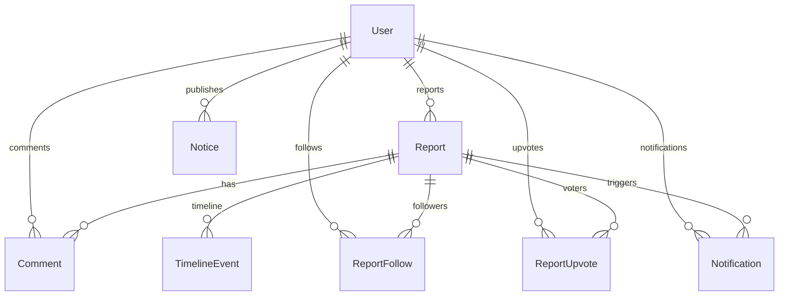

# Backend Implementation Plan

This document outlines the transition plan to convert the C.L.E.A.R. MVP (which relies on mock data and local JSON files) into a production-ready, deployable application backed by a relational PostgreSQL database and Prisma ORM.

---

## Outdated Documentation Notice

Before proceeding, the following rules and references inside the `/docs` folder are identified as outdated or conflicting under a production database architecture:
1. **`docs/DEVELOPMENT_RULES.md` (Rule 1.2 - Do Not Overengineer)**: The rule stating that the backend must "handle data storage with simple array manipulations, and write updates cleanly back to the JSON files" is outdated. We are officially replacing the in-memory array manipulation and JSON file writes with **Prisma ORM and PostgreSQL queries**.
2. **`docs/DEVELOPMENT_RULES.md` (Rule 1.1 - Maintain API Parity)**: Overriding `window.fetch` inside `public/app.js` will become obsolete. The client should make real HTTP requests to the backend server. The mock interceptor in `public/app.js` will be disabled for HTTP connections and maintained only for standalone static execution (if necessary).
3. **`docs/DATABASE_REFERENCE.md`**:
   - The document lists credentials stored in plain text inside `localStorage` under `clear_users`. In production, users will be stored in PostgreSQL, and passwords will be securely hashed on the backend.
   - The nested arrays for `comments`, `timeline`, `resolutionImages`, and `additionalImages` in JSON files will be normalized into relational SQL tables to ensure database integrity, indexing, and scalability.
   - Notifications will be moved from memory to a dedicated PostgreSQL table to persist across server restarts.
4. **`docs/API_REFERENCE.md`**:
   - The claim that there are "no backend REST endpoints for login and registration" is outdated. We will build fully secured auth endpoints (`/api/auth/register`, `/api/auth/login`, `/api/auth/logout`, `/api/auth/me`).
   - The notification section will be expanded with real GET/PATCH endpoints to pull and dismiss alerts.

---

## 1. Current State Analysis

The current codebase is a hybrid mock prototype with some parts of the API defined in the backend, but with user auth and session handling isolated entirely to the client-side browser:

| Feature | Current State | Mock Data / Storage Location | Client vs. Server |
| :--- | :--- | :--- | :--- |
| **Authentication** | Frontend Only | `localStorage` key `clear_users` (Plain-text passwords) | Frontend reads/writes locally. Server has no user DB. |
| **Sessions** | Frontend Only | `localStorage` keys `clear_user_authenticated` and `clear_username` | Simulated. Easily bypassed. |
| **Report Submission**| Partial Server | In-memory server array saved to `issues.json` | Client sends base64 image data in POST. Server writes to file. |
| **Triage & Statuses**| Partial Server | In-memory server array saved to `issues.json` | Kanban transitions update server array. |
| **Comments** | Partial Server | Nested `comments` array inside `issues.json` | Appended to report array. Comments have no real user identity check. |
| **Notices** | Partial Server | In-memory server array saved to `notices.json` | Created and read from server. |
| **Notifications** | In-Memory (Server) | Express variable `let notifications = []` | Notifications are pushed on server status updates but never fetched by UI. |
| **File Storage** | Base64 Mock | Base64 data strings stored directly in JSON files | No image file upload handler. Massive storage/performance bottleneck. |

---

## 2. Recommended Project Structure

We recommend **retaining the single-repo monolithic layout** instead of a monorepo. Since the current structure is already divided into a clean frontend `public/` directory and a root Express backend `server.js`, a monorepo structure would introduce unnecessary build pipeline complexity (Yarn Workspaces, Turborepo, etc.) without offering any deployment benefits.

### Cleaning Up Boilerplates
To simplify deployment and reduce codebase noise, we will delete unused boilerplate folders:
- Delete `client/` (Unused Vite + React template).
- Delete `server/` (Empty template directory).

### Target Workspace Structure
```
clear/
├── docs/                   # System documentation
├── media/                  # Persistent volume for local uploaded images
│   └── uploads/            # Real uploaded files (managed by Multer)
├── node_modules/
├── prisma/
│   ├── migrations/         # Database migration history
│   └── schema.prisma       # Active Prisma Schema (PostgreSQL)
├── public/                 # Static frontend code
│   ├── app.js              # Vanilla JS frontend (updated to talk to real APIs)
│   ├── index.html          # HTML Layout (no changes to structure)
│   └── style.css           # Neo-Brutalist stylesheet
├── .env                    # Environment variables (git-ignored)
├── package.json            # Simplified dependencies
├── prisma.config.ts        # Prisma ORM configurations
└── server.js               # Express server (updated to query Prisma and handle uploads)
```

---

## 3. Backend Stack

We will use a minimal, robust production stack to keep the architecture easy to deploy and maintain:

*   **Runtime**: Node.js (v18+)
*   **Framework**: Express.js (keeps route architecture aligned with the current server)
*   **Database**: PostgreSQL (relational model structure, excellent support for indexing and geography, standard for production)
*   **ORM**: Prisma ORM (natively generates typed client database interfaces, easy database migrations, fits existing configuration)
*   **Authentication**: JSON Web Tokens (JWT) signed with a backend secret and sent to the client via **HTTP-only, secure, SameSite=Strict cookies**. This provides strong XSS/CSRF security.
*   **File Uploads**: `multer` middleware for Express to store uploads as files in `/media/uploads/` on disk (and store their relative path URLs in the database).
*   **Validation**: `zod` for validating request payloads (already in `package.json`).
*   **Environment Variables**: `dotenv` to load configurations.

---

## 4. Database Design

We will transition the database from JSON files to 8 normalized tables in PostgreSQL:



### 4.1 Tables Schema & Details

#### 1. `User`
*   **Purpose**: Stores credentials and roles for both citizens and municipal officers.
*   **Fields**:
    *   `id`: `String` (UUID) - Primary Key.
    *   `username`: `String` - Unique display name.
    *   `email`: `String` - Unique, verified email.
    *   `password`: `String` - Hashed password (bcrypt).
    *   `role`: `String` - `"citizen"` or `"municipal"`.
    *   `district`: `String` (Optional) - Uppercase, municipal officer's assigned district.
    *   `authKey`: `String` (Optional) - Shared/specific signup verification key for municipal roles.
    *   `createdAt`: `DateTime` (Default: now).
*   **Indexes**: Unique index on `email`, Unique index on `username`.

#### 2. `Report` (Code: `Issue`)
*   **Purpose**: Holds environmental hazard reports.
*   **Fields**:
    *   `id`: `Int` - Primary Key, Auto-incrementing (aligned with current ID parameters).
    *   `title`: `String` (Max 100 characters).
    *   `description`: `String` (Optional, Max 500 characters).
    *   `location`: `String` (Default: `"Punjab"`).
    *   `subLocation`: `String` - Uppercase Punjab district.
    *   `latitude`: `Float` - Spatial coordinates.
    *   `longitude`: `Float` - Spatial coordinates.
    *   `imageType`: `String` (Default: `"default"`).
    *   `images`: `String[]` - Array of file paths of uploaded citizen photos.
    *   `upvotes`: `Int` (Default: 1).
    *   `createdAt`: `DateTime` (Default: now).
    *   `status`: `String` (Default: `"Review Queue"`).
    *   `internalNotes`: `String` (Default: `""`).
    *   `resolutionNote`: `String` (Optional).
    *   `resolutionImages`: `String[]` - File paths for resolution photo proof.
    *   `rejectionReason`: `String` (Optional).
    *   `rejectedAt`: `DateTime` (Optional).
    *   `appealMessage`: `String` (Optional).
    *   `additionalImages`: `String[]` - File paths of appeal photos.
    *   `appealedAt`: `DateTime` (Optional).
    *   `isAnonymous`: `Boolean` (Default: `false`).
    *   `authorId`: `String` - Foreign Key linking to `User.id`.
*   **Indexes**:
    *   `subLocation` (for district filtering).
    *   `status` (for Kanban board columns query).
    *   `authorId` (for retrieval of "My Issues").

#### 3. `Comment`
*   **Purpose**: Stores discussions on reports.
*   **Fields**:
    *   `id`: `Int` - Primary Key, Auto-incrementing.
    *   `reportId`: `Int` - Foreign Key linking to `Report.id`.
    *   `authorId`: `String` - Foreign Key linking to `User.id`.
    *   `text`: `String` - Comment body text.
    *   `createdAt`: `DateTime` (Default: now).
*   **Indexes**: Index on `reportId`, Index on `authorId`.

#### 4. `TimelineEvent`
*   **Purpose**: Logs report lifecycle status transitions for audit.
*   **Fields**:
    *   `id`: `Int` - Primary Key, Auto-incrementing.
    *   `reportId`: `Int` - Foreign Key linking to `Report.id`.
    *   `status`: `String` - Status transition stage.
    *   `timestamp`: `DateTime` (Default: now).
*   **Indexes**: Index on `reportId`.

#### 5. `ReportFollow`
*   **Purpose**: Many-to-Many relation table mapping which citizens follow which reports.
*   **Fields**:
    *   `userId`: `String` - Foreign Key linking to `User.id`.
    *   `reportId`: `Int` - Foreign Key linking to `Report.id`.
*   **Indexes**: Composite Primary Key `(userId, reportId)`.

#### 6. `ReportUpvote`
*   **Purpose**: Tracks citizen upvotes to prevent multiple upvotes on the same issue by one citizen.
*   **Fields**:
    *   `userId`: `String` - Foreign key linking to `User.id`.
    *   `reportId`: `Int` - Foreign key linking to `Report.id`.
*   **Indexes**: Composite Primary Key `(userId, reportId)`.

#### 7. `Notice`
*   **Purpose**: Official municipal alerts and campaigns.
*   **Fields**:
    *   `id`: `Int` - Primary Key, Auto-incrementing.
    *   `title`: `String`.
    *   `description`: `String`.
    *   `location`: `String` (Default: `"Punjab"`).
    *   `subLocation`: `String` - Uppercase Punjab district.
    *   `type`: `String` - `"Warning"` or `"Drive / Campaign"`.
    *   `expiryDate`: `DateTime` (Optional).
    *   `createdAt`: `DateTime` (Default: now).
    *   `authorId`: `String` - Foreign Key linking to `User.id`.
*   **Indexes**: Index on `subLocation`, Index on `expiryDate`.

#### 8. `Notification`
*   **Purpose**: Real-time database alerts for report followers when status changes.
*   **Fields**:
    *   `id`: `Int` - Primary Key, Auto-incrementing.
    *   `userId`: `String` - Recipient user, Foreign Key linking to `User.id`.
    *   `reportId`: `Int` - Report target, Foreign key linking to `Report.id`.
    *   `message`: `String` - Human readable alert summary.
    *   `status`: `String` - Transition status.
    *   `read`: `Boolean` (Default: `false`).
    *   `createdAt`: `DateTime` (Default: now).
*   **Indexes**: Index on `userId`.

---

## 5. Authentication Plan

Authentication will be moved to a standard, stateless JWT architecture:

```
[Register/Login Form] ---> POST /api/auth/login ---> [Hash / Verify Passwords]
                                                                |
[Client Authenticated] <--- HTTP-Only Cookie (Token) <--- [Generate JWT token]
```

### 5.1 Flows
1.  **Registration (`POST /api/auth/register`)**:
    - Input: `username`, `email`, `password`, `role`, `district` (optional), `authKey` (optional).
    - If `role` is `municipal`, verify that `authKey` matches the environment variable security key (`MUNICIPAL_AUTH_KEY`). If it doesn't match, reject creation.
    - Check if `username` or `email` already exists.
    - Hash the password using `bcryptjs` with 10 salt rounds.
    - Save user to the database.
    - Generate JWT and set it in a secure cookie.
2.  **Login (`POST /api/auth/login`)**:
    - Input: `emailOrUsername`, `password`.
    - Check user record matching email/username.
    - Compare input password with database hashed password via `bcrypt.compare`.
    - Generate JWT containing `{ userId, username, role, district }`.
    - Set the token inside a cookie:
      ```javascript
      res.cookie('token', token, {
        httpOnly: true,
        secure: process.env.NODE_ENV === 'production',
        sameSite: 'strict',
        maxAge: 7 * 24 * 60 * 60 * 1000 // 7 days
      });
      ```
3.  **Logout (`POST /api/auth/logout`)**:
    - Clears the `token` cookie.
4.  **Authorization Middleware (`requireAuth`, `requireRole`)**:
    - Extract user payload from cookie JWT.
    - Check for required roles (e.g. `MUNICIPAL` for Kanban state changes, notices posting, and internal notes updates).

### 5.2 Anonymous Posting Ownership
Anonymous reports need to hide user identity from public streams, but keep the reporter connected so they can view, follow, and appeal:
- **Database level**: The report retains a real `authorId` reference to the reporting user's `User.id` and sets `isAnonymous: true`.
- **API level**: When serializing reports to client queries, the route checks:
  *   If `isAnonymous` is `true`, and the logged-in user is **neither** the author **nor** a municipal officer, the returned `authorName` is masked as `"Anonymous"`.
  *   Otherwise, the creator's real username is returned.
  *   This preserves private ownership for the author's "My Issues" query while maintaining citizen privacy.

---

## 6. APIs Required

All production endpoints require standard input validation via Zod schemas and request sanitization.

### 6.1 Authentication Group
*   `POST /api/auth/register` (Public) - Register new account. Validates role checks and hashes password.
*   `POST /api/auth/login` (Public) - Verify credentials and return session cookie.
*   `POST /api/auth/logout` (Auth Required) - Clear session cookie.
*   `GET /api/auth/me` (Auth Required) - Decodes token cookie and returns session data for dashboard profiles.

### 6.2 Reports & Appeals Group
*   `GET /api/issues` (Auth Required) - Get list of issues. Accepts search queries, district filters, followed only, and my issues.
*   `POST /api/issues` (Auth Required - Citizen Only) - Create a report. Handles file upload attachments.
*   `GET /api/issues/:id` (Auth Required) - Retrieve details of a specific report.
*   `POST /api/issues/:id/vote` (Auth Required - Citizen Only) - Toggle upvote state (limits users to 1 vote).
*   `POST /api/issues/:id/follow` (Auth Required - Citizen Only) - Toggle following state (adds record to `ReportFollow` table).
*   `POST /api/issues/:id/appeal` (Auth Required - Citizen Only) - Challenge report rejection. Accepts new images via file uploads.

### 6.3 Comments Group
*   `POST /api/issues/:id/comments` (Auth Required) - Post a comment on a report.
*   `GET /api/issues/:id/comments` (Auth Required) - Fetch comments list (instead of nested array in report query, if performance optimization is needed).

### 6.4 Municipality Operations Group
*   `PATCH /api/issues/:id/status` (Auth Required - Municipal Only) - Triage operations: Acknowledge, Start Work, Reject (requires category reason), Resolve (requires uploaded resolution photo and note).
*   `PATCH /api/issues/:id/notes` (Auth Required - Municipal Only) - Add internal notes to a report.

### 6.5 Notices Group
*   `GET /api/notices` (Auth Required) - View notices list.
*   `POST /api/notices` (Auth Required - Municipal Only) - Publish community bulletin.

### 6.6 Notifications Group
*   `GET /api/notifications` (Auth Required) - Fetch status alerts for followed issues.
*   `PATCH /api/notifications/:id/read` (Auth Required) - Mark notification as read.

---

## 7. File Storage Strategy

We recommend **Local Directory Disk Storage** (using the `multer` middleware) as the simplest production starting point.

- **Pipeline**: Frontend uploads files as `multipart/form-data`. Multer saves files under `/media/uploads/` on the server disk with unique hashes. The database records the static URL path to the file.
- **Scale Optimization**: Storing file path strings (e.g. `"/media/uploads/f81903-img.jpg"`) replaces the massive base64 text blobs in the JSON database. This keeps database payload size small and enables fast static file delivery.
- **Future Cloud Migration**: Using `multer` abstracts file ingestion. If the app needs to scale out across multiple servers in the future, the upload route can be updated to stream uploaded buffers directly to a cloud bucket (AWS S3 or Cloudinary) without changing the database schema structure or the frontend upload UI.

---

## 8. Deployment Plan

The platform is deployed using a decoupled **Frontend/Backend Proxy** architecture to maximize performance, hosting efficiency, and maintain same-origin cookie mechanics:

1.  **Backend (Express API Server)**:
    *   **Hosting**: Deployed on **Render** at `https://clear-oqy2.onrender.com`.
    *   **Runtime**: Node.js `server.js` listening on Render's assigned dynamic port.
    *   **Responsibility**: Rest APIs (`/api/*`), uploads handling, and serving static uploaded media (`/media/*`).
2.  **Frontend (Static SPA)**:
    *   **Hosting**: Deployed on **Vercel**.
    *   **Output Target**: Configured to serve the static assets from the `public` directory directly.
    *   **Proxy rewrites**: Utilizing `vercel.json` rewrites to proxy `/api/*` and `/media/*` requests under same-origin to the Render backend, preserving HTTP-Only session cookies with `SameSite=Strict`.
3.  **Database**:
    *   **Hosting**: Hosted Serverless PostgreSQL via **Neon**.
    *   **Integration**: Connected via Prisma Client with the `driverAdapters` preview feature enabled.
4.  **Environment Variables (`.env` Configuration)**:
    *   `DATABASE_URL`: Neon connection string.
    *   `JWT_SECRET`: Secure encryption key for signing user sessions.
    *   `MUNICIPAL_AUTH_KEY`: Pre-shared credential for authority registration (configured as `HX291Z`).
    *   `PORT`: Dynamic port assigned by Render.
5.  **File Storage Warning**:
    *   Render's local ephemeral filesystem is used for `/media/uploads/`. For long-term production persistence, this folder should be mapped to a Render Persistent Volume or migrated to cloud object storage (e.g. AWS S3 / Cloudinary).

---

## 9. Migration Roadmap

The conversion from MVP mock to production will be implemented in five distinct phases to prevent regressions and isolate issues:

```
[Phase 1: DB & ORM Setup] ──> [Phase 2: Secure Auth System] ──> [Phase 3: File Upload Handler]
                                                                        |
[Phase 5: Notice & Notify] <── [Phase 4: Reports & Comments DB] <───────┘
```

*   **Phase 1: DB & ORM Setup**
    - Install `prisma`, `@prisma/client`, `bcryptjs`, `jsonwebtoken`, `multer`, `dotenv`.
    - Establish `prisma/schema.prisma` with defined tables and run migrations.
*   **Phase 2: Secure Auth System**
    - Code auth controllers (`POST /api/auth/register`, `POST /api/auth/login`).
    - Implement token creation, cookies, and authentication middleware.
    - Update `public/app.js` login/register submissions to communicate with auth routes. Disable client-side mock registration and login logic.
*   **Phase 3: File Upload Handler**
    - Wire up Multer file destination middleware in `server.js`.
    - Modify report creation forms, resolution popups, and appeal modals in `public/app.js` to send raw images using `FormData` (`multipart/form-data`) instead of base64 JSON buffers.
*   **Phase 4: Reports & Comments Database Integration**
    - Rewrite API handlers for reports, upvoting, following, commenting, and appeals in `server.js` using Prisma client queries.
    - Hook up the timeline transition logger.
    - Update feed listings in `public/app.js` to parse relational items correctly.
*   **Phase 5: Notices & Notifications Wiring**
    - Transition notices endpoints to query PostgreSQL database.
    - Write database trigger logic to log notifications on report status transitions.
    - Wire the notifications bell click handler and list feed inside `public/app.js` (completing the UI placeholder).

---

## 10. Missing Backend Features List

These features are currently implemented purely as placeholders or simulated client-side logic and require complete backend support:

1.  **Hashed User Registry**: Database storage of credential mappings with salt/hashing functions.
2.  **Stateless Session Validation**: Token verification middleware protecting private citizen and officer dashboards.
3.  **Multipart Upload Route**: Ingestion pipeline for citizen hazard pictures and officer resolution proofs.
4.  **Multi-user Follow Mappings**: Relational links mapping multiple citizens to individual tracked reports (currently tracks only via a mock global boolean flag).
5.  **Strict Upvote Restrictions**: Relational locking preventing citizens from upvoting a report multiple times.
6.  **Real-Time Notifications Feed**: Endpoint to serve updates for followed issues to the UI bell dropdown.
7.  **District Notice Mapping**: Auto-scoping Notice creation to the specific district of the logged-in municipal officer.

---

## 11. Suggested Development Order

To minimize code rewrites and build a stable foundation, follow this development order:

1.  **Configure Prisma Schema**: Establish all tables, schemas, relations, and database migration.
2.  **Authentication Backend**: Write register, login, profile retrieval, middleware tokens, and tests.
3.  **Authentication Frontend**: Connect login, registration, and logout buttons in `public/app.js` to secure endpoints.
4.  **Multer File Upload**: Establish static file upload pipeline and set storage directories.
5.  **Citizen Report CRUD**: Establish report creation (with real uploaded images) and feed retrieval (with correct anonymization logic).
6.  **Triage Operations**: Connect the Kanban board columns, status updates, rejection categories, appeals recycling, and resolution confirmations to the database.
7.  **Interactions (Votes, Comments, Follows)**: Wire comments submission, user-specific upvote constraints, and user-specific following tables.
8.  **Bulletins & Alerts**: Implement Notices database features and wire up the Notifications bell drawer UI.
