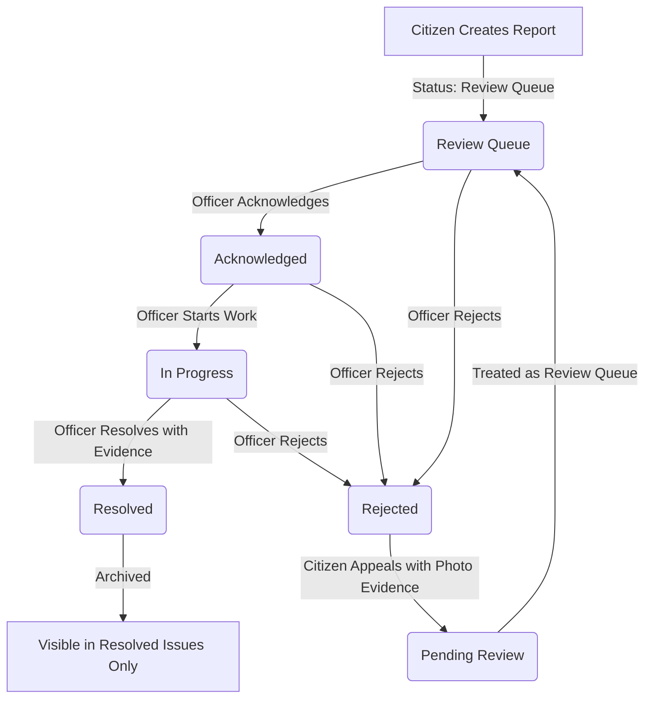

# Report Lifecycle

This document describes the state machine, transitions, and interactions that govern a report's lifecycle in the C.L.E.A.R. platform.

---

## 1. Lifecycle State Machine

Below is the state transition diagram for an environmental report:

---

## 2. Detailed Status Definitions

### 2.1 Review Queue (Pending Triage)
*   **Trigger**: Citizen submits the "Create Report" form.
*   **Properties**:
    *   `status = "Review Queue"`
    *   Renders under the municipal **"Review Queue"** Kanban column.
    *   Renders in the citizen Explore feed with a `"Review Queue"` badge (often styled as "Pending Review").
    *   Dynamic priority score determines its initial priority label (Low, Medium, High).

### 2.2 Acknowledged (Triage Accepted)
*   **Trigger**: Municipal officer clicks **"Acknowledge"** on the issue's triage action ribbon.
*   **Properties**:
    *   `status = "Acknowledged"`
    *   Moves to the **"Acknowledged"** column on the municipal Kanban board.
    *   Renders in the citizen Explore feed as `"Acknowledged"`.
    *   Signifies that the municipality has verified the hazard and is planning squad dispatch.

### 2.3 In Progress (Crew Dispatched)
*   **Trigger**: Municipal officer clicks **"Start Work"** on the triage action ribbon of an Acknowledged issue.
*   **Properties**:
    *   `status = "In Progress"`
    *   Moves to the **"In Progress"** column on the Kanban board.
    *   Field teams are active on site.

### 2.4 Resolved (Completed & Verified)
*   **Trigger**: Municipal officer clicks **"Resolve Report"**, uploads an "After" resolution image, and writes a resolution note.
*   **Properties**:
    *   `status = "Resolved"`
    *   Removed from the municipal Kanban board and the citizen **Explore** feed stream.
    *   Visible in the citizen detail view under followed/my issues, and the municipal **Resolved Issues** history feed.
    *   A before/after image grid is shown in the details drawer, along with a completion note and transition audit timeline.

### 2.5 Rejected (Dismissed)
*   **Trigger**: Municipal officer clicks **"Reject"** in the details drawer, selects a rejection reason, and submits the rejection modal.
*   **Properties**:
    *   `status = "Rejected"`
    *   Removed from the municipal Kanban board.
    *   Remains visible to the reporting citizen on their "My Issues" tab with a `"Rejected"` status badge and the designated reason (e.g. "Duplicate of another report", "Incorrect location").
    *   Enables the **"Submit Additional Evidence"** appeal button in the citizen's detail drawer.

### 2.6 Pending Review (Appealed Report)
*   **Trigger**: Citizen clicks "Submit Additional Evidence", uploads a new verification photo, and writes an explanation.
*   **Properties**:
    *   `status = "Pending Review"`
    *   The report re-enters the municipal Triage Board in the **"Review Queue"** column.
    *   Shows a special appeal indicator in the details panel, along with the citizen's additional evidence.
    *   Officer can choose to **Acknowledge** (move to Acknowledged) or **Reject** again.

---

## 3. Supplementary Lifecycle Rules

### 3.1 Anonymous Reports
*   If `isAnonymous` is toggled `true` during creation:
    *   The database record retains the creator's real `authorId` mapping.
    *   For other users (who are neither the author nor a municipal officer), the backend masks the `authorName` as `"Anonymous"` in the serialized JSON response.
    *   The reporting citizen can still find and track the issue under their **"My Issues"** tab (since the backend matches their session user ID to the report's `authorId`).

### 3.2 Notifications & Timeline Audits
*   **Historical Timeline**: Every status update appends an event to the report's `TimelineEvent` table containing `{ status, timestamp }`. This is displayed on resolved report detail drawers as a vertical audit trail.
*   **Notifications Store**: In the database backend, toggling status updates for followed issues inserts notification records into the `Notification` table:
    *   Recipient: All users following the report (stored in `ReportFollow`).
    *   Message: `"Report \"[title]\" status updated to [newStatus]."`
    *   Status: `newStatus`
    *   Read: `false`

### 3.3 Following Behavior
*   A citizen can toggle **"Follow"** on any report card, which adds/removes a record in the `ReportFollow` table.
*   Followed reports are filtered into the **"Following"** navigation feed.
*   Following an issue opts the user into receiving status updates when the report transitions.

